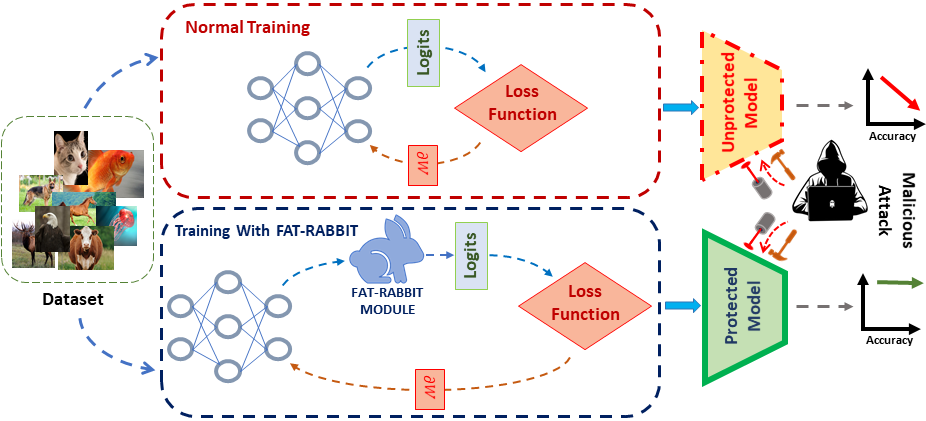

# 🐰 FAT-RABBIT: Fault-Aware Training towards Robustness Against Bit-flip Based Attacks in Deep Neural Networks

This repository provides the implementation of **FAT-RABBIT**, a fault-aware training scheme that enhances the robustness of deep neural networks (DNNs) against **bit-flip attacks (BFA)**. It also includes **Mutated-SAM (M-SAM)**, a novel optimization scheme, and the **Augmented FAT-RABBIT**, a hybrid approach that further strengthens model defense under fault injection.


*Figure 1: An overview of FAT-RABBIT.*

## 🔬 Overview

Bit-flip attacks can dramatically reduce DNN accuracy by flipping only a few critical bits in weight memory (e.g., via Row-Hammer or laser illumination). FAT-RABBIT trains models under simulated fault conditions and new optimization method (M-SAM) to reduce sensitivity to such attacks by:

- Flattening the distribution of critical weights.
- Flipping most significant bits (MSB) during training.
- Employing fixed-point quantization (Q1.(q−1)) to limit representational error.

📌 *No hardware changes are required—robustness is purely achieved during training.*

---

## 📊 Key Features

- ⚠️ **Fault injection-aware training (FAT-RABBIT)**
- 🔁 **Mutated SAM (M-SAM) Optimizer** for better generalization under faults
- 🛡️ **Augmented FAT-RABBIT** combines both techniques for enhanced protection
- ✅ Compatible with CIFAR-10/100 datasets and ResNet architectures (18, 20, 32, 44)
- 🧪 Tested under MSB flips, random bit flips, and multi-bit fault attacks

---

## 📁 Project Structure

```bash
.
├── src/                        # Core implementation (FAT-RABBIT, M-SAM)
├── results/                    # Accuracy logs, graphs, evaluation outputs
├── figures/                    # Figures from paper
├── README.md                   # You're here
└── requirements.txt            # Dependencies

